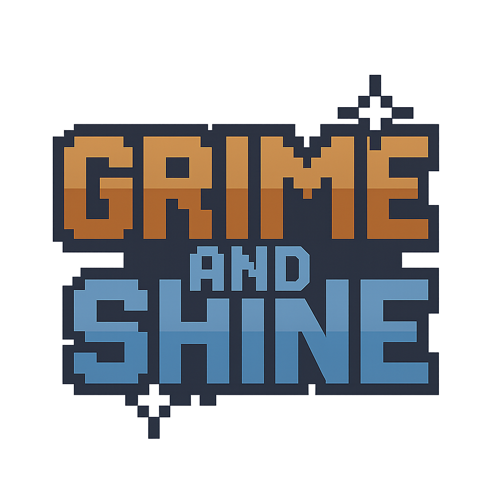

# Grime and Shine



Grime and Shine is a browser-based, vehicle-themed **roguelike** game. Players take on the role of a car cleaner in a busy parking lot, aiming to service as many cars as possible within the time limit while earning cash and upgrading their abilities across increasingly challenging levels.

## Gameplay Mechanics

- **Core Loop:** Interact with parked cars to perform actions: Search, Clean, or Vacuum. Each action takes time and earns cash.
- **Level Progression:** Levels increase in difficulty with more cars spawning and less time available.
- **Objective:** Complete a level by interacting with all cars before time runs out. If the timer expires, the level is still passed if at least 50% of cars were serviced.
- **Roguelike Elements:**
    - **Upgrades:** After each successful level, choose one of three offered upgrades or temporary buffs to enhance player stats (e.g., speed, loot chance, alarm reduction) for the next level or the entire run.
    - **Perma-death (Run-based):** Failing a level (less than 50% cars serviced when time runs out) ends the current run.
    - **Meta-progression:** Earned cash can potentially be used to unlock new characters with unique starting abilities (currently implemented but unlock mechanism might need refinement).
- **Car Variety:** Different car types (Sedan, SUV, Sports Car, etc.) have unique modifiers affecting action times and outcomes.
- **Special Properties:** Cars may randomly spawn with special properties like "Extra Dirty" (longer cleaning time, more cash) or "Hidden Compartment" (better search loot).
- **Random Events:** Some levels may feature random events (e.g., "Rainstorm" making cleaning faster) that modify gameplay.
- **Timer:** A constantly decreasing timer adds pressure to each level.
- **Controls:** Use Arrow Keys to move, 'E' to interact with nearby cars, Number Keys to select actions/upgrades, and Esc/Backspace to go back.

## Features

- Multiple vehicle types with unique characteristics.
- Procedurally generated level challenges.
- Upgrade system with permanent and temporary buffs.
- Unlockable characters (planned/partially implemented).
- Custom pixel art graphics and assets.
- Runs in any modern browser via a local web server.

## Getting Started

To play the game:

1. Clone or download this repository.
2. Serve the project directory using a local web server (e.g., VSCode Live Server extension, Python's `http.server`, or any other web server).
3. Open the provided local server URL (e.g., `http://localhost:8000`) in your preferred web browser.

**Note:** Opening the `index.html` file directly will not work properly, as the JavaScript cannot load image assets without a web server.

## Project Structure

```
├── index.html          # Main HTML file
├── style.css           # Stylesheet
├── game.js             # Game logic in JavaScript
├── Art/                # Game assets (images, fonts)
│   ├── *.png
│   └── *.woff
└── README.md           # Project documentation
```

## Requirements

- A modern web browser (Chrome, Firefox, Edge, Safari)
- A local web server to run the game.

## AI Assistance

This project was created with the help of generative AI tools, including:

- ChatGPT (used for generating images)
- Google Gemini Pro 2.5
- Claude Sonnet 3.7
- The unknown Quasar model (used for code generation)

---

Enjoy playing Grime and Shine!